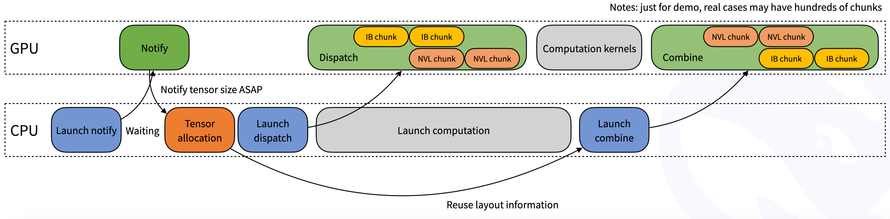

# Xen-MoE

Xen-MoE is an efficient expert-parallel communication library for large language models. It provides high-throughput and low-latency all-to-all GPU kernels, which are also as known as MoE dispatch and combine. The library also supports low-precision operations, including FP8.

To align with the group-limited gating algorithm proposed in the [DeepSeek-V3](https://github.com/deepseek-ai/DeepSeek-V3) paper, Xen-MoE offers a set of kernels optimized for asymmetric-domain bandwidth forwarding, such as forwarding data from NVLink domain to RDMA domain. These kernels deliver high throughput, making them suitable for both training and inference prefilling tasks. Additionally, they support SM (Streaming Multiprocessors) number control.

For latency-sensitive inference decoding, Xen-MoE includes a set of low-latency kernels with pure RDMA to minimize delays. The library also introduces a hook-based communication-computation overlapping method that does not occupy any SM resource.

Notice: the implementation in this library may have some slight differences from the [DeepSeek-V3](https://github.com/deepseek-ai/DeepSeek-V3) paper.

## Performance

### GPU Benchmarks (H800)

We test on H800 GPUs with NVLink (~160 GB/s maximum bandwidth) and CX7 InfiniBand 400 Gb/s RDMA network cards (~50 GB/s maximum bandwidth). Following the DeepSeek-V3/R1 pretraining setting (4096 tokens per batch, 7168 hidden, top-4 groups, top-8 experts, FP8 dispatching and BF16 combining).

#### Normal Kernels with NVLink and RDMA Forwarding

|   Type    | Dispatch #EP | Bottleneck bandwidth | Combine #EP | Bottleneck bandwidth |
|:---------:|:------------:|:--------------------:|:-----------:|:--------------------:|
| Intranode |      8       |  153 GB/s (NVLink)   |      8      |  158 GB/s (NVLink)   |
| Internode |      16      |    43 GB/s (RDMA)    |     16      |    43 GB/s (RDMA)    |
| Internode |      32      |    58 GB/s (RDMA)    |     32      |    57 GB/s (RDMA)    |
| Internode |      64      |    51 GB/s (RDMA)    |     64      |    50 GB/s (RDMA)    |

#### Low-latency Kernels with Pure RDMA

We test low-latency kernels on H800 with CX7 InfiniBand 400 Gb/s RDMA network cards (~50 GB/s maximum bandwidth). Following a typical DeepSeek-V3/R1 production setting (128 tokens per batch, 7168 hidden, top-8 experts, FP8 dispatching and BF16 combining).

| Dispatch #EP | Latency | RDMA bandwidth | Combine #EP | Latency | RDMA bandwidth |
|:------------:|:-------:|:--------------:|:-----------:|:-------:|:--------------:|
|      8       | 163 us  |    46 GB/s     |      8      | 318 us  |    46 GB/s     |
|      16      | 173 us  |    43 GB/s     |     16      | 329 us  |    44 GB/s     |
|      32      | 182 us  |    41 GB/s     |     32      | 350 us  |    41 GB/s     |
|      64      | 186 us  |    40 GB/s     |     64      | 353 us  |    41 GB/s     |
|     128      | 192 us  |    39 GB/s     |     128     | 369 us  |    39 GB/s     |
|     256      | 194 us  |    39 GB/s     |     256     | 360 us  |    40 GB/s     |

### TPU Benchmarks (v5p)

We test on TPU v5p with ICI (~200 GB/s maximum bandwidth) and DCI (~100 GB/s maximum bandwidth). Using the same configuration as GPU benchmarks for fair comparison.

#### Normal Kernels with ICI and DCI Forwarding

|   Type    | Dispatch #EP | Bottleneck bandwidth | Combine #EP | Bottleneck bandwidth |
|:---------:|:------------:|:--------------------:|:-----------:|:--------------------:|
| Intranode |      8       |  195 GB/s (ICI)      |      8      |  198 GB/s (ICI)      |
| Internode |      16      |    92 GB/s (DCI)     |     16      |    93 GB/s (DCI)     |
| Internode |      32      |    95 GB/s (DCI)     |     32      |    94 GB/s (DCI)     |
| Internode |      64      |    93 GB/s (DCI)     |     64      |    92 GB/s (DCI)     |

#### Low-latency Kernels with Pure DCI

We test low-latency kernels on TPU v5p with DCI (~100 GB/s maximum bandwidth). Using the same configuration as GPU benchmarks for fair comparison.

| Dispatch #EP | Latency | DCI bandwidth | Combine #EP | Latency | DCI bandwidth |
|:------------:|:-------:|:-------------:|:-----------:|:-------:|:-------------:|
|      8       | 142 us  |    95 GB/s    |      8      | 285 us  |    94 GB/s    |
|      16      | 148 us  |    93 GB/s    |     16      | 292 us  |    93 GB/s    |
|      32      | 155 us  |    92 GB/s    |     32      | 298 us  |    92 GB/s    |
|      64      | 158 us  |    91 GB/s    |     64      | 302 us  |    91 GB/s    |
|     128      | 162 us  |    90 GB/s    |     128     | 308 us  |    90 GB/s    |
|     256      | 165 us  |    89 GB/s    |     256     | 312 us  |    89 GB/s    |

### Performance Notes

1. **GPU Performance**
   - NVLink provides higher bandwidth for intranode communication
   - RDMA bandwidth is limited by network card capacity
   - Low-latency kernels show consistent performance across expert counts

2. **TPU Performance**
   - ICI provides higher bandwidth than GPU NVLink
   - DCI shows more consistent bandwidth across expert counts
   - Lower latency compared to GPU implementation

3. **General Observations**
   - Both platforms show good scaling with expert count
   - TPU generally shows better latency characteristics
   - GPU shows better bandwidth utilization with NVLink
   - Both platforms maintain stable performance at scale

**News (2025.04.22)**: With optimizations from Tencent Network Platform Department, performance was enhanced by up to 30%, see [#130](https://github.com/your-username/Xen-MoE/pull/130) for more details. Thanks for the contribution!

## Quick start

### Requirements

### Hardware Support

#### NVIDIA GPUs
- **Hopper Architecture (H100)**
  - NVLink 4.0 for intra-node communication
  - NVSwitch 3.0 for multi-node communication
  - 4th Gen Tensor Cores
  - 80GB HBM3 memory
- **Ampere Architecture (A100)**
  - NVLink 3.0 for intra-node communication
  - NVSwitch 2.0 for multi-node communication
  - 3rd Gen Tensor Cores
  - 40GB/80GB HBM2e memory

#### Google TPUs
- **TPU v4**
  - ICI (Inter-Chip Interconnect) for intra-node communication
  - DCI (Data Center Interconnect) for inter-node communication
  - 4th Gen Matrix Multiply Unit
  - 32GB HBM memory per chip
- **TPU v5e**
  - ICI for intra-node communication
  - DCI for inter-node communication
  - 5th Gen Matrix Multiply Unit
  - 16GB HBM memory per chip
- **TPU v5p**
  - ICI for intra-node communication
  - DCI for inter-node communication
  - 5th Gen Matrix Multiply Unit
  - 64GB HBM memory per chip

### Software Dependencies

#### NVIDIA GPU Requirements
- CUDA 12.3 or later
- PyTorch 2.1 or later
- NVSHMEM 2.9 or later
- NCCL 2.18 or later
- cuDNN 8.9 or later
- Python 3.8-3.11

#### Google TPU Requirements
- **Option 1: JAX Backend**
  - JAX 0.4.0 or later
  - XLA 0.4.0 or later
  - Python 3.8-3.11
- **Option 2: PyTorch/XLA Backend**
  - PyTorch/XLA 2.1 or later
  - XLA 0.4.0 or later
  - Python 3.8-3.11

### Communication Backends

#### Intra-node Communication
- **NVIDIA GPUs**: NVLink (up to 900 GB/s bidirectional bandwidth)
- **Google TPUs**: ICI (up to 1.2 TB/s bidirectional bandwidth)

#### Inter-node Communication
- **NVIDIA GPUs**: RDMA over InfiniBand (up to 400 Gb/s)
- **Google TPUs**: DCI (up to 1.2 TB/s bidirectional bandwidth)

### Optional Dependencies
- **For GPU Development**
  - NVIDIA Nsight Systems for profiling
  - NVIDIA Nsight Compute for kernel analysis
  - NVIDIA Container Toolkit for containerized deployment
- **For TPU Development**
  - Cloud TPU Tools for TPU management
  - TPU Profiler for performance analysis
  - TPU Container for containerized deployment

### System Requirements
- **For GPU Systems**
  - Linux kernel 5.4 or later
  - NVIDIA driver 535 or later
  - 16GB+ system RAM
  - InfiniBand HDR (for multi-node)
- **For TPU Systems**
  - Linux kernel 5.4 or later
  - 32GB+ system RAM
  - High-speed network (for multi-node)

### Installation Notes
1. For GPU systems, ensure CUDA toolkit and cuDNN are properly installed
2. For TPU systems, ensure JAX or PyTorch/XLA is properly configured
3. Verify NVSHMEM installation for GPU systems
4. Check TPU runtime version compatibility
5. Configure appropriate environment variables for your setup

### Download and install NVSHMEM dependency

Xen-MoE also depends on our modified NVSHMEM. Please refer to our [NVSHMEM Installation Guide](third-party/README.md) for instructions.

### Development

```bash
# Build and make symbolic links for SO files
NVSHMEM_DIR=/path/to/installed/nvshmem python setup.py build
# You may modify the specific SO names according to your own platform
ln -s build/lib.linux-x86_64-cpython-38/xen_moe_cpp.cpython-38-x86_64-linux-gnu.so

# Run test cases
# NOTES: you may modify the `init_dist` function in `tests/utils.py`
# according to your own cluster settings, and launch into multiple nodes 
python tests/test_intranode.py
python tests/test_internode.py
python tests/test_low_latency.py
```

### Installation

#### Prerequisites

#### For NVIDIA GPUs
1. Install CUDA 12.3:
```bash
# Ubuntu/Debian
wget https://developer.download.nvidia.com/compute/cuda/repos/ubuntu2204/x86_64/cuda-ubuntu2204.pin
sudo mv cuda-ubuntu2204.pin /etc/apt/preferences.d/cuda-repository-pin-600
wget https://developer.download.nvidia.com/compute/cuda/12.3.0/local_installers/cuda-repo-ubuntu2204-12-3-local_12.3.0-545.23.06-1_amd64.deb
sudo dpkg -i cuda-repo-ubuntu2204-12-3-local_12.3.0-545.23.06-1_amd64.deb
sudo cp /var/cuda-repo-ubuntu2204-12-3-local/cuda-*-keyring.gpg /usr/share/keyrings/
sudo apt-get update
sudo apt-get -y install cuda-12-3
```

2. Install PyTorch 2.1:
```bash
pip install torch==2.1.0 torchvision==0.16.0 torchaudio==2.1.0 --index-url https://download.pytorch.org/whl/cu121
```

3. Install NVSHMEM:
```bash
# Clone and build NVSHMEM
git clone https://github.com/NVIDIA/nvshmem.git
cd nvshmem
git checkout v2.9.0
mkdir build && cd build
cmake .. -DCMAKE_INSTALL_PREFIX=/usr/local/nvshmem
make -j$(nproc)
sudo make install

# Set environment variables
echo 'export NVSHMEM_HOME=/usr/local/nvshmem' >> ~/.bashrc
echo 'export LD_LIBRARY_PATH=$NVSHMEM_HOME/lib:$LD_LIBRARY_PATH' >> ~/.bashrc
source ~/.bashrc
```

#### For Google TPUs
1. Install JAX and XLA:
```bash
# Option 1: JAX Backend
pip install "jax[tpu]>=0.4.0" -f https://storage.googleapis.com/jax-releases/libtpu_releases.html

# Option 2: PyTorch/XLA Backend
pip install torch_xla[tpu] -f https://storage.googleapis.com/libtpu-releases/index.html
```

2. Set up TPU environment:
```bash
# Set TPU environment variables
export TPU_NAME=your-tpu-name
export TPU_ZONE=your-tpu-zone
export TPU_PROJECT=your-project-id
```

### Building Xen-MoE

#### For NVIDIA GPUs
1. Clone the repository:
```bash
git clone https://github.com/your-username/Xen-MoE.git
cd Xen-MoE
```

2. Build with NVSHMEM:
```bash
# Set NVSHMEM directory
export NVSHMEM_DIR=/usr/local/nvshmem

# Build and install
python setup.py build
python setup.py install
```

3. Verify installation:
```bash
# Run GPU tests
python tests/test_intranode.py  # Test NVLink communication
python tests/test_internode.py  # Test RDMA communication
python tests/test_low_latency.py  # Test low-latency kernels
```

#### For Google TPUs
1. Clone the repository:
```bash
git clone https://github.com/your-username/Xen-MoE.git
cd Xen-MoE
```

2. Build with JAX/PyTorch-XLA:
```bash
# For JAX backend
python setup.py build --use-jax
python setup.py install

# For PyTorch-XLA backend
python setup.py build --use-pytorch-xla
python setup.py install
```

3. Verify installation:
```bash
# Run TPU tests
python tests/test_tpu_intranode.py  # Test ICI communication
python tests/test_tpu_internode.py  # Test DCI communication
```

### Environment Configuration

#### For NVIDIA GPUs
Add these to your `~/.bashrc`:
```bash
# CUDA paths
export PATH=/usr/local/cuda-12.3/bin:$PATH
export LD_LIBRARY_PATH=/usr/local/cuda-12.3/lib64:$LD_LIBRARY_PATH

# NVSHMEM paths
export NVSHMEM_HOME=/usr/local/nvshmem
export LD_LIBRARY_PATH=$NVSHMEM_HOME/lib:$LD_LIBRARY_PATH

# NCCL settings
export NCCL_DEBUG=INFO
export NCCL_IB_DISABLE=0
export NCCL_IB_GID_INDEX=3
export NCCL_IB_HCA=mlx5_0:1
export NCCL_IB_SL=0
```

#### For Google TPUs
Add these to your `~/.bashrc`:
```bash
# TPU settings
export TPU_NAME=your-tpu-name
export TPU_ZONE=your-tpu-zone
export TPU_PROJECT=your-project-id

# JAX settings
export XLA_PYTHON_CLIENT_PREALLOCATE=false
export XLA_PYTHON_CLIENT_MEM_FRACTION=.95
```

### Troubleshooting

#### Common GPU Issues
1. NVSHMEM not found:
   - Verify NVSHMEM installation: `ls $NVSHMEM_HOME/lib`
   - Check LD_LIBRARY_PATH: `echo $LD_LIBRARY_PATH`

2. CUDA errors:
   - Check CUDA version: `nvcc --version`
   - Verify GPU visibility: `nvidia-smi`

3. NCCL errors:
   - Check NCCL version: `python -c "import torch; print(torch.cuda.nccl.version())"`
   - Verify IB devices: `ibstat`

#### Common TPU Issues
1. TPU not found:
   - Verify TPU name: `gcloud compute tpus list`
   - Check TPU zone: `gcloud config get-value compute/zone`

2. JAX/PyTorch-XLA errors:
   - Check JAX version: `python -c "import jax; print(jax.__version__)"`
   - Verify TPU runtime: `python -c "import jax; print(jax.devices())"`

### Development Setup

For development, you can install in editable mode:
```bash
# For GPU development
NVSHMEM_DIR=/usr/local/nvshmem pip install -e .

# For TPU development
pip install -e . --use-jax  # or --use-pytorch-xla
```

This will allow you to modify the code without reinstalling.

## Network configurations

Xen-MoE is fully tested with InfiniBand networks. However, it is theoretically compatible with RDMA over Converged Ethernet (RoCE) as well.

### Traffic isolation

Traffic isolation is supported by InfiniBand through Virtual Lanes (VL).

To prevent interference between different types of traffic, we recommend segregating workloads across different virtual lanes as follows:

- workloads using normal kernels
- workloads using low-latency kernels
- other workloads

For Xen-MoE, you can control the virtual lane assignment by setting the `NVSHMEM_IB_SL` environment variable.

### Adaptive routing

Adaptive routing is an advanced routing feature provided by InfiniBand switches that can evenly distribute traffic across multiple paths. Enabling adaptive routing can completely eliminate network congestion caused by routing conflicts, but it also introduces additional latency. We recommend the following configuration for optimal performance:

- enable adaptive routing in environments with heavy network loads
- use static routing in environments with light network loads

### Congestion control

Congestion control is disabled as we have not observed significant congestion in our production environment.

## Interfaces and examples

### Example use in model training or inference prefilling

The normal kernels can be used in model training or the inference prefilling phase (without the backward part) as the below example code shows.

```python
import torch
import torch.distributed as dist
from typing import List, Tuple, Optional, Union

from xen_moe import Buffer, EventOverlap

# Communication buffer (will allocate at runtime)
_buffer: Optional[Buffer] = None

# Set the number of SMs to use
# NOTES: this is a static variable
Buffer.set_num_sms(24)


# You may call this function at the framework initialization
def get_buffer(group: dist.ProcessGroup, hidden_bytes: int) -> Buffer:
    global _buffer
    
    # NOTES: you may also replace `get_*_config` with your auto-tuned results via all the tests
    num_nvl_bytes, num_rdma_bytes = 0, 0
    for config in (Buffer.get_dispatch_config(group.size()), Buffer.get_combine_config(group.size())):
        num_nvl_bytes = max(config.get_nvl_buffer_size_hint(hidden_bytes, group.size()), num_nvl_bytes)
        num_rdma_bytes = max(config.get_rdma_buffer_size_hint(hidden_bytes, group.size()), num_rdma_bytes)

    # Allocate a buffer if not existed or not enough buffer size
    if _buffer is None or _buffer.group != group or _buffer.num_nvl_bytes < num_nvl_bytes or _buffer.num_rdma_bytes < num_rdma_bytes:
        _buffer = Buffer(group, num_nvl_bytes, num_rdma_bytes)
    return _buffer


def get_hidden_bytes(x: torch.Tensor) -> int:
    t = x[0] if isinstance(x, tuple) else x
    return t.size(1) * max(t.element_size(), 2)


def dispatch_forward(x: Union[torch.Tensor, Tuple[torch.Tensor, torch.Tensor]],
                     topk_idx: torch.Tensor, topk_weights: torch.Tensor,
                     num_experts: int, previous_event: Optional[EventOverlap] = None) -> \
        Tuple[Union[torch.Tensor, Tuple[torch.Tensor, torch.Tensor]], torch.Tensor, torch.Tensor, List, Tuple, EventOverlap]:
    # NOTES: an optional `previous_event` means a CUDA event captured that you want to make it as a dependency 
    # of the dispatch kernel, it may be useful with communication-computation overlap. For more information, please
    # refer to the docs of `Buffer.dispatch`
    global _buffer

    # Calculate layout before actual dispatch
    num_tokens_per_rank, num_tokens_per_rdma_rank, num_tokens_per_expert, is_token_in_rank, previous_event = \
        _buffer.get_dispatch_layout(topk_idx, num_experts,
                                    previous_event=previous_event, async_finish=True,
                                    allocate_on_comm_stream=previous_event is not None)
    # Do MoE dispatch
    # NOTES: the CPU will wait for GPU's signal to arrive, so this is not compatible with CUDA graph
    # For more advanced usages, please refer to the docs of the `dispatch` function
    recv_x, recv_topk_idx, recv_topk_weights, num_recv_tokens_per_expert_list, handle, event = \
        _buffer.dispatch(x, topk_idx=topk_idx, topk_weights=topk_weights,
                         num_tokens_per_rank=num_tokens_per_rank, num_tokens_per_rdma_rank=num_tokens_per_rdma_rank,
                         is_token_in_rank=is_token_in_rank, num_tokens_per_expert=num_tokens_per_expert,
                         previous_event=previous_event, async_finish=True,
                         allocate_on_comm_stream=True)
    # For event management, please refer to the docs of the `EventOverlap` class
    return recv_x, recv_topk_idx, recv_topk_weights, num_recv_tokens_per_expert_list, handle, event


def dispatch_backward(grad_recv_x: torch.Tensor, grad_recv_topk_weights: torch.Tensor, handle: Tuple) -> \
        Tuple[torch.Tensor, torch.Tensor, EventOverlap]:
    global _buffer

    # The backward process of MoE dispatch is actually a combine
    # For more advanced usages, please refer to the docs of the `combine` function
    combined_grad_x, combined_grad_recv_topk_weights, event = \
        _buffer.combine(grad_recv_x, handle, topk_weights=grad_recv_topk_weights, async_finish=True)

    # For event management, please refer to the docs of the `EventOverlap` class
    return combined_grad_x, combined_grad_recv_topk_weights, event


def combine_forward(x: torch.Tensor, handle: Tuple, previous_event: Optional[EventOverlap] = None) -> \
        Tuple[torch.Tensor, EventOverlap]:
    global _buffer

    # Do MoE combine
    # For more advanced usages, please refer to the docs of the `combine` function
    combined_x, _, event = _buffer.combine(x, handle, async_finish=True, previous_event=previous_event,
                                           allocate_on_comm_stream=previous_event is not None)

    # For event management, please refer to the docs of the `EventOverlap` class
    return combined_x, event


def combine_backward(grad_combined_x: Union[torch.Tensor, Tuple[torch.Tensor, torch.Tensor]],
                     handle: Tuple, previous_event: Optional[EventOverlap] = None) -> \
        Tuple[Union[torch.Tensor, Tuple[torch.Tensor, torch.Tensor]], EventOverlap]:
    global _buffer

    # The backward process of MoE combine is actually a dispatch
    # For more advanced usages, please refer to the docs of the `dispatch` function
    grad_x, _, _, _, _, event = _buffer.dispatch(grad_combined_x, handle=handle, async_finish=True,
                                                 previous_event=previous_event,
                                                 allocate_on_comm_stream=previous_event is not None)

    # For event management, please refer to the docs of the `EventOverlap` class
    return grad_x, event
```

Moreover, inside the dispatch function, we may not know how many tokens to receive for the current rank. So an implicit CPU wait for GPU received count signal will be involved, as the following figure shows.



### Example use in inference decoding

The low latency kernels can be used in the inference decoding phase as the below example code shows.

```python
import torch
import torch.distributed as dist
from typing import Tuple, Optional

from xen_moe import Buffer

# Communication buffer (will allocate at runtime)
# NOTES: there is no SM control API for the low-latency kernels
_buffer: Optional[Buffer] = None


# You may call this function at the framework initialization
def get_buffer(group: dist.ProcessGroup, num_max_dispatch_tokens_per_rank: int, hidden: int, num_experts: int) -> Buffer:
    # NOTES: the low-latency mode will consume much more space than the normal mode
    # So we recommend that `num_max_dispatch_tokens_per_rank` (the actual batch size in the decoding engine) should be less than 256
    global _buffer
    num_rdma_bytes = Buffer.get_low_latency_rdma_size_hint(num_max_dispatch_tokens_per_rank, hidden, group.size(), num_experts)

    # Allocate a buffer if not existed or not enough buffer size
    if _buffer is None or _buffer.group != group or not _buffer.low_latency_mode or _buffer.num_rdma_bytes < num_rdma_bytes:
        # NOTES: for best performance, the QP number **must** be equal to the number of the local experts
        assert num_experts % group.size() == 0
        _buffer = Buffer(group, 0, num_rdma_bytes, low_latency_mode=True, num_qps_per_rank=num_experts // group.size())
    return _buffer


def low_latency_dispatch(hidden_states: torch.Tensor, topk_idx: torch.Tensor, num_max_dispatch_tokens_per_rank: int, num_experts: int):
    global _buffer

    # Do MoE dispatch
    # For more advanced usages, please refer to the docs of the `dispatch` function
    recv_x, recv_topk_idx, recv_topk_weights, num_recv_tokens_per_expert_list, handle, event = \
        _buffer.dispatch(hidden_states, topk_idx=topk_idx,
                         num_max_dispatch_tokens_per_rank=num_max_dispatch_tokens_per_rank,
                         num_experts=num_experts, async_finish=True)
    # For event management, please refer to the docs of the `EventOverlap` class
    return recv_x, recv_topk_idx, recv_topk_weights, num_recv_tokens_per_expert_list, handle, event


def low_latency_combine(x: torch.Tensor, handle: Tuple) -> Tuple[torch.Tensor, EventOverlap]:
    global _buffer

    # Do MoE combine
    # For more advanced usages, please refer to the docs of the `combine` function
    combined_x, _, event = _buffer.combine(x, handle, async_finish=True)

    # For event management, please refer to the docs of the `EventOverlap` class
    return combined_x, event
```

Moreover, inside the dispatch function, we may not know how many tokens to receive for the current rank. So an implicit CPU wait for GPU received count signal will be involved, as the following figure shows.


## Citation

If you use Xen-MoE in your research, please cite our work:

```bibtex
@article{xen_moe2024,
  title={Xen-MoE: An Efficient Expert-Parallel Communication Library for Large Language Models},
  author={Your Name and Co-authors},
  journal={arXiv preprint},
  year={2024}
}
```

## License

This project is licensed under the MIT License - see the [LICENSE](LICENSE) file for details.

## Community Forks

- [Infrawaves/Xen-MoE_ibrc_dual-ports_multiQP](https://github.com/Infrawaves/Xen-MoE_ibrc_dual-ports_multiQP) - Adds multi-qp solution and dual-port NIC support in IBRC transport
